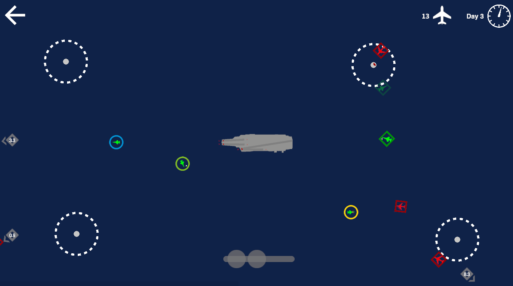

# Mini Fighters

A Mini Airways mod for fighting off enemy attacks. In this mod, you will need to direct fights to take off and shoot down incoming enemy planes to get points. Each fighter only has the ammo capacity to take down two enemies. To shoot down an enemy, simply align your fighter's heading to the enemy, and wait for the enemy to get within range. After the fight is out-of-ammo, it has to return to land. 

Different color fighter has different speed and agility. The speed of the fighter increases from blue, green, pink, yellow, orange, and red, while the turning radius increases in the same order.

The game now runs in "endless" mode. Unless the score dips below 0, the game won't end. You get one point deducted each time you lose a fighter. That is, having them out-of-bound, collide with each other, or collide with an enemy plane.

Note: to get the F16 icon onto your fighters, you need to first load into a non-London game official map. You are free to load into any custom map after exiting the official map.

# How to Install

- Switch the game to `mod_feat` [branch](https://partner.steamgames.com/doc/store/application/branches?) on Steam.
- Backup and remove all `.dll` in `<path_to_game>\Mini Airways\BepInEx\plugins`.
- Copy [MiniFighters.dll](https://github.com/ericpzh/MiniFighters/blob/main/bin/Debug/netstandard2.1/MiniFighters.dll) into `<path_to_game>\Mini Airways\BepInEx\plugins`
- Recommand to use the included [map](https://github.com/ericpzh/MiniFighters/blob/main/AircraftCarrier.cm1).

***

# 迷你空战

一个模拟空战的迷你空管Mod。您需要指挥战斗机起飞并击落来袭的敌机，每一架击落可以获得一分。每架战斗机携带的弹药量仅够击落两架敌机，只需指挥备弹充足的战斗机飞向敌机，然后静待敌机进入射程即可将其击落。在弹药耗尽后，您需要指挥战斗机返场着陆。

不同颜色的战机拥有不同的性能，战机的速度以蓝色、绿色、粉色、黄色、橙色、红色的顺序依次递增，转弯半径也以相同的顺序依次增大。

游戏现在以无尽模式运行，除非分数低于 0，否则游戏不会结束。每次您失去一架战斗机（战机飞出边界、相互碰撞或与敌机相撞）会被扣一分。

想要正确加载战斗机图标，请首先加载入一张不是伦敦的官方地图。

# 如何安装

- 右键库中的Mini Airways，[属性 - 测试版 - mod_feat](https://partner.steamgames.com/doc/store/application/branches?l=schinese), 更新。
- 备份然后删除所有 `<path_to_game>\Mini Airways\BepInEx\plugins`里的`.dll`文件。
- 复制 [MiniFighters.dll](https://github.com/ericpzh/MiniFighters/blob/main/bin/Debug/netstandard2.1/MiniFighters.dll) 到 `<path_to_game>\Mini Airways\BepInEx\plugins`。
- 推荐使用自带 [地图](https://github.com/ericpzh/MiniFighters/blob/main/AircraftCarrier.cm1).
